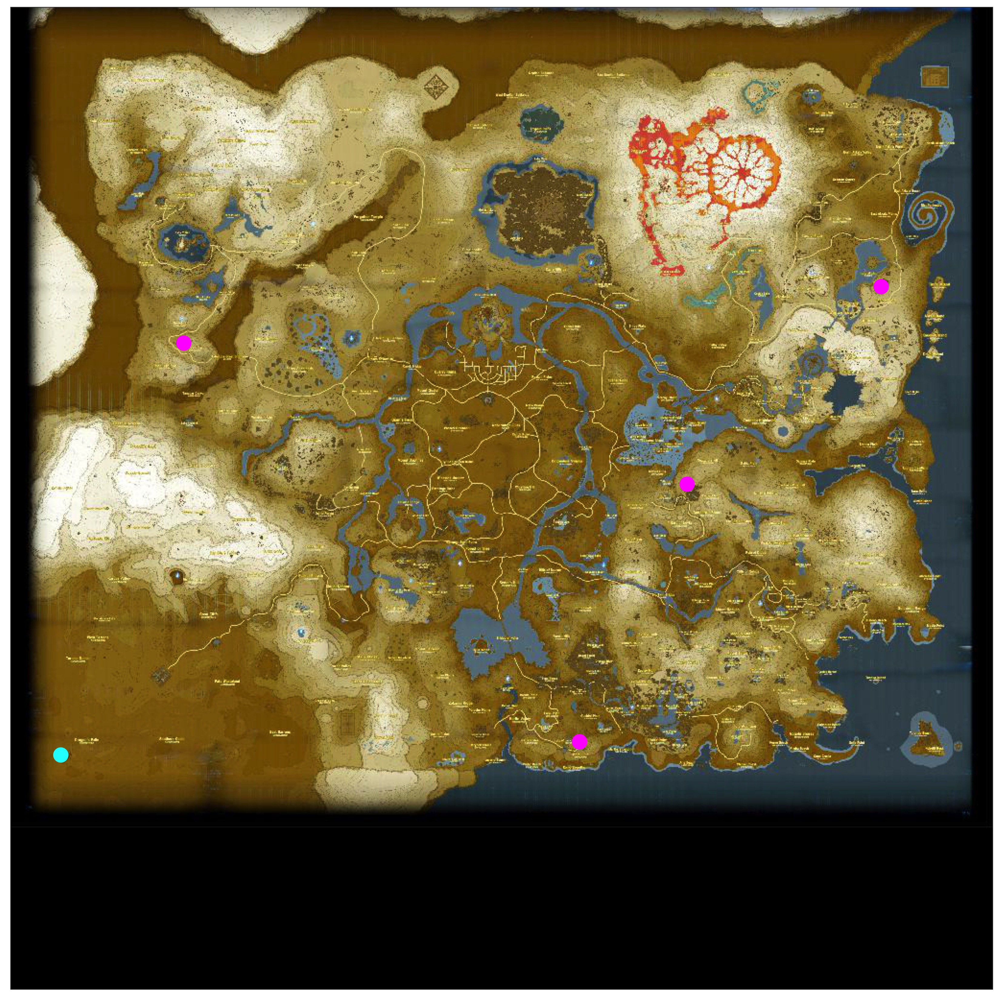

# Description
Code to plot BOTW game location visits on a map image. The final image is 1024x1024; too small to read map labels, but maybe someone will fork the code/idea to a larger map. The code was written in the R language out of convenience, but it should be simple to translate to other languages that let you plot points on images and access Google Spreadsheets. The main value is in the coordinate locations on Google Spreadsheets: https://docs.google.com/spreadsheets/d/1QvlstuYoEWSxvwS91qePRyHTQhynZwoRxEIYruN5C4k/edit?usp=sharing

# Install Dependencies 
    setRepositories(ind=1:6)
    options(repos="http://cran.rstudio.com/")
    install.packages(c("googlesheets", "ggplot2", "jpeg"))

# Run 
Change visitedWorksheet and locationWorksheet if you want to see something other than fountains. NOTE: You may or may not need to save the botw_maps spreadsheet to your own Google account to work; not sure.  

    source("plotVisits.R")

# Example (Fountains)

Cyan (visited), magenta (not visited)

